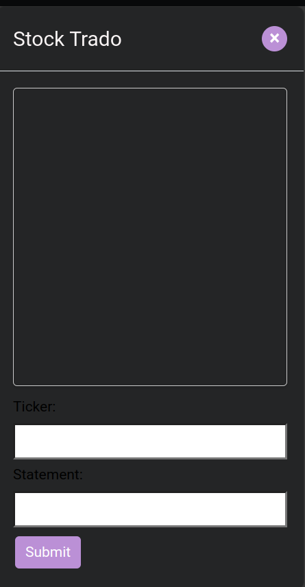

# stock-prediction-teamrando
stock-prediction-teamrando created by GitHub Classroom

## Table of Contents

 - [Overview]()
 - [Features]()
 - [Stock Prediction App]()
 - [Chatbot App]()
 - [RESTful API]()
 - [Tech Stack]()
 - [Getting Started]()
 - [Prerequisites]()
 - [Installation]()
 - [Testing]()
 - [Deployment]()
 - [Contributing]()
 - [License]()
 - [Authors and Acknowledgment]()
 - [🚀 About us]()
 - [ Links]()

 

## Overview
The Stock Prediction Trading Web Application Software project is a comprehensive full-stack application designed to facilitate intelligent trading decision-making. This application provides an interactive platform for users to predict stock prices, engage with a user-friendly chatbot for financial data, and access a RESTful API for raw data retrieval.

Built using cutting-edge technologies such as Python, Django, Django all-auth, Plotly, yfinance, Pandas, Numpy, and Spacy, this project represents our commitment to combining complex backend algorithms with a user-friendly front-end.

## Features

Interactive Visualizations: This feature would provide a more user-friendly approach to understanding stock data. Interactive charts would allow users to zoom, pan, and hover over data points to get more detailed information.

Real-time Stock Data: This feature would provide real-time updates on stock prices and other related information. This would allow users to stay up-to-date with the latest movements in the stock market.

User Authentication and Profiles: Implementing user authentication would allow users to have personalized profiles. They could save their favorite stocks, view their search history, and customize their app settings.

Portfolio Management: This feature would allow users to track their investments, view the total value of their portfolio, and monitor their performance over time.

## Stock Prediction App

The heart of the application lies in its ability to generate actionable buy and sell signals for specific stock tickers. The app utilizes yfinance to gather seven days of historical data for the selected company. It then uses an array of technical indicators and strategies to generate these signals:

- Exponential Moving Averages (EMA)
- Simple Moving Averages (SMA)
- Bollinger Bands
- Stochastic Oscillator
- Relative Strength Index (RSI)
- Moving Average Convergence Divergence (MACD)

## Chatbot App

To enhance user engagement, we've developed a chatbot app using Spacy and NLP. This chatbot responds to specific questions about the stock, such as volume or asset price, providing users with a conversational interface to access important financial data.

## RESTful API
In the spirit of openness and collaboration, we've included a RESTful API in the application to retrieve raw data in JSON format. This feature enables other developers to access the buy and sell signals and use them in their own applications or analytical processes.

## Tech Stack

Our web application’s interface was developed using HTML, CSS, and JavaScript, with backend services developed in Python and Django. Our tech stack is as follows:

- Frontend: HTML, CSS, JavaScript
- Backend: Python, Django, Django all-auth
- Data Visualization: Plotly
- Data Manipulation: Pandas, Numpy
- Stock Data: yfinance
- NLP: Spacy
## Getting Started

These instructions will guide you to get a copy of the project up and running on your local machine for development and testing purposes.

Prerequisites
List all the software and versions you need to install before running your project.

For example:

- Python (3.8 or higher)
- Django (3.0 or higher)
- yfinance, numpy, pandas, spacy, plotly (latest versions)
- Git

### Installation
Provide a step by step series of instructions to set up the project. Here's a basic example:

#### 1- Clone the repository:

  Using HTTPS:

  $ git clone https://github.com/YOUR_USERNAME/YOUR_REPOSITORY.git

  Or using SSH:

  $ git clone git@github.com:YOUR_USERNAME/YOUR_REPOSITORY.git

#### 2- Navigate into the directory:

  $ cd YOUR_REPOSITORY

#### 3- Create a virtual environment and activate it:

On macOS and Linux:

$ python3 -m venv env

$ source env/bin/activate

On Windows:

$ py -m venv env

$ .\env\Scripts\activate

#### 4- Install the requirements:

$ pip install -r requirements.txt

#### 5- Apply migrations:

$ python manage.py migrate

#### 6- Run the server:

$ python manage.py runserver

Your project should now be running at http://127.0.0.1:8000/.

  

## Prerequisites

Detailed prerequisites and system requirements (e.g., Python version, Django version, etc.)
## 🚀 About us
students at DCI institute

# Hi, WE USE GITHUB! 👋

https://github.com/amiri-reza

https://github.com/andresfelipecs

https://github.com/Bhamdou

## 🔗 Links

## Badges

Add badges from somewhere like: [shields.io](https://shields.io/)

